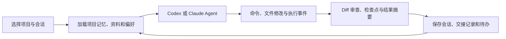
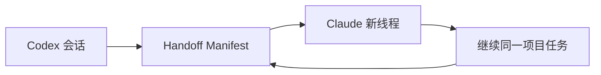

<p align="center">
  
</p>

<h1 align="center">hey chat</h1>

<p align="center">
  本机优先的 macOS 个人 Agent 工作台。把长期项目、Codex / Claude 路由、可审查执行、资料与待办放在同一个桌面应用里。
</p>

<p align="center">
  <strong>macOS 原生 SwiftUI</strong> · <strong>Base URL + API Key</strong> · <strong>本地持久化</strong> · <strong>Frutiger Aero</strong>
</p>


## 它解决什么问题

hey chat 不是网页登录器，也不尝试做多用户 SaaS。它面向一台 Mac、一个使用者和长期积累的项目工作：

- 在一个项目下保存多个 Agent 会话，而不是每次从空白聊天重新开始。
- 使用自己购买的聚合渠道，通过 `Base URL + API Key` 配置 Codex 或 Claude Agent 模型。
- 在同一任务中切换模型，保留项目状态、完整可见历史、执行证据和结构化交接内容。
- 每轮执行都有检查点、真实 Diff、命令结果和安全恢复入口。
- 为项目沉淀记忆、资料引用、常用工作流和待办，而不是把关键背景散落在聊天记录中。

普通聊天、图片、视频与 Skills 仍可独立使用；个人 Agent 工作台是应用的核心能力。

## 下载

当前预编译版本：

- [hey chat v1.1 - macOS arm64](Releases/hey-chat-macos-arm64-v1.1.zip)
- [SHA-256 校验值](Releases/SHA256SUMS)
- 架构：Apple Silicon (`arm64`)
- 最低系统：macOS 26.5

解压后将 `hey chat.app` 拖入“应用程序”。发布包是临时签名、未经过 Apple 公证的个人版本；首次被系统拦截时，在 Finder 中右键应用并选择“打开”，或前往“系统设置 → 隐私与安全性”确认打开。

## Agent 工作方式



### 项目与会话

每个 Agent 项目对应一个本机工作目录，可以拥有多条独立会话。会话会保存：

- 对话和附件记录、CLI thread、当前模型路由、推理强度。
- 命令、文件变更、执行耗时、token 使用量和完成状态。
- 每轮任务的 Git/工作区检查点、真实 Diff 和恢复记录。
- 上下文压缩代次、模型切换和 CLI 恢复的交接 Manifest。

切换到聊天、媒体或模型管理后再返回，项目和会话均保持本机持久化。项目和会话记录可独立删除，不会删除你的实际代码目录。

### 可审查执行与恢复

每次 Agent 任务开始前，hey chat 会记录工作区基线；完成后生成该轮真实变更，而不是把已有未提交修改错误归因给 Agent。

- 在“审查”中按文件查看增删行、补丁和二进制文件提示。
- 显示任务模型、渠道、耗时、命令结果、测试情况和最终状态。
- 在符合安全条件时，可恢复到本轮 Agent 运行前的检查点。
- 恢复前会检测额外人工修改，避免静默覆盖后续工作。

建议在 Git 仓库中使用 Agent，并在重要节点保留自己的提交。

### 无损多路由交接

一个会话不绑定单一模型。你可以让 Codex 负责执行，再切换 Claude 继续分析、重构或审查，然后再切回。不同 CLI 的原生 thread 无法互通，因此 hey chat 使用本地持久化的 `Handoff Manifest` 衔接：



交接包保留用户目标、硬性约束、项目路径、记忆、已完成事项、待办、修改文件、关键命令与退出码、失败原因、附件路径和最近对话。新模型会被要求以当前工作区的真实状态为准。

这里的“无损”有明确边界：

- 本地项目状态、完整可见历史、任务记录和关键执行证据不会因切换而丢失。
- 模型上下文会进行结构化压缩，不会逐 token 复制所有成功命令的长输出。
- 自动压缩、手动模型切换和 CLI 恢复都会留下可查看的版本化 Manifest。

“上下文”面板可以查看每一份 Manifest 的触发原因、来源条目数、估算 token、目标模型、传递状态和完整正文。

### 项目记忆与个人偏好

项目记忆用于保存目标、技术栈、常用命令、代码规范、约束和已知问题；个人偏好用于保存跨项目的执行习惯。它们都可编辑、可关闭，并会在新会话、模型切换和 CLI 恢复时继续生效。

项目记忆与个人偏好只会注入 Agent 请求，不会进入普通聊天、图片或视频请求。

### 快捷工作流

Agent 顶栏的“快捷”提供内置工作流：

- 检查项目
- 构建与测试
- 总结变更
- 定位并修复

也可以为每个项目创建自己的工作流，定义图标、提示模板和是否在执行前要求补充输入。`{{input}}` 会在运行时替换为补充内容。

### 本地资料库与收件箱

“资料”用于挂载项目关联的文件或文件夹：

- 支持 Markdown、文本、代码、JSON、CSV、配置文件及 PDF 的有限本地文本索引。
- 支持按名称、路径和已索引内容搜索，查看匹配摘录，并随时刷新或移除索引。
- 原文件不会复制进应用；引用后，下一次 Agent 请求只附带来源路径和匹配摘录，Agent 可按需读取原文件。

“收件箱”是全局本机待办：可快速记录临时事项、标记完成、归入任意 Agent 项目，之后通过“交给 Agent”写回对应项目的输入框。

### 维护、备份与健康检查

“维护”面板用于长期个人使用：

- 健康检查项目目录、资料来源、Inbox 和 Agent 历史文件，并明确显示失效原因。
- 导出或导入 `.heychat-agent-backup` 备份。
- 导入前自动创建当前 Agent 数据的保护备份。
- 备份包含项目、会话、运行记录、记忆、资料索引引用、工作流、Inbox 和个人偏好。

API Key、Keychain 内容和原始资料文件均不会写入备份。

## Agent 模型配置

Agent 只保留两条执行路线：

| 路线 | 本机 CLI | 上游协议 | 适用场景 |
| --- | --- | --- | --- |
| Codex | Codex CLI | Responses API | 开发、命令执行、持续任务 |
| Claude | Claude Code CLI | Anthropic Messages | 阅读、重构、审查、跨模型接续 |

配置方式：

1. 进入“模型管理”，新建或编辑 Agent 模型。
2. 选择 Codex 或 Claude 渠道，填写模型标识、Base URL、API Key 和默认推理强度。
3. 保存并启用模型。
4. 返回 Agent，在顶部模型菜单选择所需路由；推理强度可在相邻菜单单独覆盖。

应用不要求登录 Codex、Claude 或 Grok 账号。所有请求都使用你配置的中转站、聚合渠道或自建网关。

如果本机尚未安装 CLI，Agent 顶部会提供安装按钮：

```bash
# Codex
npm i -g @openai/codex@latest

# Claude Code：官方脚本失败时会回退到 npm
bash -c 'tmp=$(mktemp) && curl -fsSL https://claude.ai/install.sh -o $tmp && bash $tmp; status=$?; rm -f $tmp; exit $status' || npm i -g @anthropic-ai/claude-code@latest
```

## 其他工作区

| 模块 | 能力 |
| --- | --- |
| 聊天 | OpenAI 兼容和 Anthropic 兼容模型、持久化会话、Skill 注入、中文输入法组合输入保护 |
| 图片 | 独立图片模型、生成、参考图处理、本地结果历史 |
| 视频 | 独立视频模型、生成与轮询、本地文件保存和预览 |
| Skills | 本机创建、启用和删除 Skills |
| 模型 | 分别管理聊天、Agent、图片、视频模型与渠道 |

## Frutiger Aero 界面

hey chat 使用明亮的天空蓝、叶绿色、白色玻璃表面和自然风景资产建立 Frutiger Aero 视觉语言，同时保持开发任务需要的信息密度：

- 用户输入、Agent 文本、命令、文件事件和完成状态保持连续的任务时间线。
- 终端长输出默认压缩，需要时可展开，避免打断阅读。
- Diff、上下文、记忆、资料和维护能力以紧凑检查器形式出现。
- 图片和视频工作区沿用相同色彩、材质和控制风格，切换模块不割裂。

主题变量集中在 `ChatMac/Design/AeroTheme.swift`。

## 本地数据与隐私

| 数据 | 存储位置 | 是否随备份导出 |
| --- | --- | --- |
| API Key | macOS Keychain | 否 |
| 聊天、模型、Skills、媒体记录 | 本机 SwiftData | 否，Agent 备份不触及这些数据 |
| Agent 项目、会话、执行记录、资料引用、Inbox | `Application Support/ChatMac/AgentHistory.json` | 是 |
| Agent 保护备份 | `Application Support/ChatMac/AgentBackups/` | 可手动保留或导出 |
| 图片、视频原文件 | 本机应用支持目录 | 否 |

构建出的 `.app` 不包含开发者本机的模型配置、API Key、Skills、聊天记录或 Agent 历史。模型请求会发送到你配置的 Base URL；Agent CLI 按任务需要访问网络、终端和已经授权的本机目录。

## 从源码构建

环境要求：

- macOS 26.5 或更高版本
- Xcode 26.6 或兼容版本
- Apple Silicon Mac
- 使用 Agent 时需要 Node.js/npm，以及 Codex CLI 或 Claude Code CLI

打开 [hey chat.xcodeproj](hey%20chat.xcodeproj)，选择 `hey chat` scheme 后使用 `Product → Build`。命令行构建：

```bash
xcodebuild \
  -project "hey chat.xcodeproj" \
  -scheme "hey chat" \
  -configuration Release \
  build
```

共享 scheme 的构建后脚本会将最新产物同步到：

```text
build/Release/hey chat.app
```

## 目录

```text
ChatMac/
├── Design/        # Frutiger Aero 主题
├── Models/        # SwiftData、Agent 历史、资料与工作流模型
├── Services/      # API、CLI、检查点、交接、索引、备份服务
├── Views/
│   ├── Agent/     # 项目、会话、审查、资料和维护界面
│   ├── Chat/      # 普通聊天
│   ├── Media/     # 图片和视频
│   ├── Models/    # 模型管理
│   ├── Sidebar/   # 导航、项目与会话列表
│   └── Skills/    # Skill 管理
├── Assets.xcassets/
Releases/          # 发布 ZIP 与校验值
Scripts/           # 构建产物同步脚本
hey chat.xcodeproj/
```

## 当前限制

- 发布 ZIP 仅支持 Apple Silicon，不包含 Intel 架构。
- 发布包为临时签名版本，未经过 Developer ID 签名和 Apple 公证。
- 不同中转站对 Responses API、Anthropic Messages 和 CLI 参数的兼容程度不同。
- Agent 的跨模型继续依赖结构化交接，不会逐字传递所有终端输出。
- 本地资料库是受控的文件索引与引用能力，不是云端知识库；原文件路径失效时需要在资料面板刷新或重新添加。

## License

本项目使用仓库中的 [LICENSE](LICENSE)。
