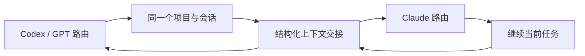

<p align="center">
  
</p>

<h1 align="center">hey chat</h1>

<p align="center">
  一个运行在 macOS 上的本地 AI 聚合客户端，将聊天、开发 Agent、图片、视频和 Skills 放进同一个工作空间。
</p>

<p align="center">
  <strong>Base URL + API Key</strong> · <strong>Codex / Claude 多路由 Agent</strong> · <strong>本地持久化</strong> · <strong>Frutiger Aero UI</strong>
</p>


## 下载

当前预编译版本：

- [hey chat v1.0 - macOS arm64](Releases/hey-chat-macos-arm64-v1.0.zip)
- 架构：Apple Silicon (`arm64`)
- 最低系统：macOS 26.5
- SHA-256：`c6594c47630f2bd44989efb9a00e833e002796778950a338f71b3326e0366468`

下载并解压后，将 `hey chat.app` 拖入“应用程序”目录。当前发布包为临时签名、未经过 Apple 公证；首次运行如果被系统阻止，请在 Finder 中右键应用并选择“打开”，或前往“系统设置 → 隐私与安全性”确认打开。

## 项目定位

hey chat 不是单一厂商客户端。它面向使用聚合中转站、自建网关或 OpenRouter 类服务的场景，通过用户自己的 Base URL 和 API Key 接入模型，不要求在应用中登录 Codex、Claude 或其他厂商账号。

应用目前包含五个主要工作区：

| 模块 | 用途 |
| --- | --- |
| 聊天 | 使用 OpenAI 兼容或 Anthropic 兼容模型进行普通对话 |
| Agent | 让 Codex CLI 或 Claude Code CLI 操作本机项目、运行命令和修改代码 |
| 媒体 | 图片生成、参考图处理和视频生成任务 |
| Skills | 管理本机 Skill，按需注入聊天上下文 |
| 模型 | 按用途管理聊天、Agent、图片和视频渠道 |

## Agent：无损多路由切换

Agent 是 hey chat 的核心。一个 Agent 会话属于某个本机项目，但不绑定单一模型。你可以先用 GPT/Codex 分析和修改代码，再在同一个会话中切换到 Claude 继续完成任务，也可以之后切回原模型。



### “无损”具体指什么

切换模型时，以下内容不会被清空或创建成另一条孤立会话：

- 项目目录和额外授权目录
- 当前会话 ID、标题和完整可见聊天历史
- 用户附件记录
- 已经写入磁盘的代码和工作区状态
- 用户的长期约束、近期任务目标和未解决问题
- 文件修改记录、失败命令和关键错误原因
- Agent 上下文代数和模型切换时间线

模型厂商的上下文窗口并不能真正共享，因此 hey chat 不会把 Codex 的 thread ID 直接交给 Claude，也不会让新模型错误恢复旧模型的原生会话。切换时会启动新的 CLI thread，并从本地完整历史生成一个结构化交接包，再将当前用户请求发送给新模型。

这里的“无损”指本地工作状态、可见历史和高信号任务语义保持连续；并不表示把所有终端日志逐字、逐 token 复制给新模型。成功命令的大段输出会被压缩，避免噪声占满上下文窗口。

### 交接包保留规则

结构化交接会优先保留：

1. 项目路径和用户最初的目标、风格及硬性约束。
2. 最近的用户与 Agent 对话。
3. 已修改文件、关键路径和代码状态。
4. 最近执行的命令、退出码，以及失败命令的错误摘要。
5. 未解决警告、异常和待办事项。
6. 用户附件的本机路径。

成功命令的长输出不会完整进入交接包；摘要有明确大小上限，并要求新模型以当前工作区的真实状态为准。模型切换后，时间线会显示“模型已切换”，方便确认后续回复属于哪个阶段。

### 自动上下文压缩

除了手动切换模型，长时间运行的会话也会自动管理上下文：

- Codex 输入上下文达到约 `120,000 tokens` 时进入应用侧换线流程。
- Claude 输入上下文达到约 `150,000 tokens` 时进入应用侧换线流程。
- 缺少精确 token 数据时，会结合文本估算、对话轮数和工具事件数量判断。
- Codex CLI 仍保留自身的原生自动压缩，并使用 hey chat 提供的结构化压缩规则。
- 原生会话恢复失败时，只有在尚未产生实质执行事件的情况下才自动换新 thread，避免命令被重复执行。

完整 UI 历史始终保存在本地。压缩只影响下一代模型上下文，不会删除用户看到的会话记录。

### 项目与会话

- 一个项目可以拥有多条独立 Agent 会话。
- 项目列表和会话历史均持久化保存。
- 支持删除项目记录或单条会话。
- 切换聊天、媒体等其他模块后再返回，Agent 历史仍然存在。
- 每条会话保存 CLI thread、当前目标路由、上下文摘要和压缩代数。

### 本机开发能力

Agent 可以在获得授权的目录中：

- 读取和修改代码文件
- 搜索仓库内容
- 执行终端命令和构建任务
- 展示命令、退出码和折叠后的终端输出
- 记录文件变化、处理时长、token 使用量和代码行变化
- 接收图片或普通文件附件
- 使用额外可写目录处理跨项目文件
- 调整模型推理强度

终端命令具有修改本机文件的能力。建议在 Git 仓库中使用 Agent，并在重要操作前保留提交或备份。

## Agent 渠道配置

Agent 模型目前分为两个执行引擎：

| 渠道 | CLI | API 协议 | 推荐用途 |
| --- | --- | --- | --- |
| Codex | Codex CLI | Responses API | 代码分析、命令执行、持续开发任务 |
| Claude | Claude Code CLI | Anthropic Messages | 代码理解、重构、跨模型接续 |

所有渠道都通过模型管理页面配置：

1. 打开“模型”。
2. 新建或编辑 Agent 模型。
3. 选择 Codex 或 Claude 渠道。
4. 填写模型标识、Base URL 和 API Key。
5. 选择默认推理强度并启用模型。
6. 返回 Agent，在顶部模型菜单中选择该路由。

API Key 写入 macOS Keychain，不保存在 Git 仓库、SwiftData 数据库或发布包中。

### CLI 安装

如果当前 Mac 没有对应 CLI，Agent 顶部状态按钮会变成安装按钮。点击后会执行：

```bash
# Codex
npm i -g @openai/codex@latest

# Claude Code：官方脚本失败时回退到 npm
bash -c 'tmp=$(mktemp) && curl -fsSL https://claude.ai/install.sh -o $tmp && bash $tmp; status=$?; rm -f $tmp; exit $status' || npm i -g @anthropic-ai/claude-code@latest
```

安装过程在后台运行，成功后自动执行版本检查；失败时会显示末尾错误信息，便于处理 Node.js、PATH 或目录权限问题。

## Frutiger Aero UI

hey chat 延续 Frutiger Aero 的明亮、自然和数字乐观主义风格，同时保持开发工具需要的信息密度：

- 天空蓝、叶绿色和白色玻璃质感组成主要色彩。
- 风景、地球和通透高光作为视觉识别，而不是纯色企业后台。
- 用户消息与 Agent 回复采用明显的左右和色彩区分。
- Agent 回复保持连续阅读流，命令与文件事件嵌入同一任务阶段。
- 多行终端命令默认压缩显示，可展开查看完整输出。
- 模型、推理强度、授权目录、附件和发送控制都集中在固定区域。
- 图片与视频工作区保持相同视觉语言，减少模块切换时的割裂感。

UI 使用 SwiftUI 构建，视觉变量集中在 `ChatMac/Design/AeroTheme.swift`，方便继续调整颜色、阴影、玻璃表面和交互状态。

## 其他能力

### 普通聊天

- OpenAI 兼容与 Anthropic 兼容渠道
- 多模型选择与会话持久化
- Skill 系统提示注入
- token、耗时和错误信息展示
- 中文输入法组合输入保护

### 图片与视频

- 独立的图片、视频模型配置
- 图片生成和参考图处理
- 视频生成、轮询与本地文件保存
- 媒体历史记录与结果预览

### Skills

- 本机 Skill 创建、启用和删除
- Skill 内容持久化
- 聊天时按会话选择 Skill

## 隐私与本地数据

hey chat 是面向单机使用的客户端：

- API Key 保存在 macOS Keychain。
- 聊天、模型元数据、Skills 和媒体记录使用本机 SwiftData。
- Agent 项目与会话历史保存在本机 Application Support 目录。
- 构建出的 `.app` 不包含开发者本机的 API Key、模型配置、Skills 或 Agent 历史。
- 模型请求会发送到用户配置的 Base URL；Agent CLI 可能根据任务访问网络或执行本机命令。

当前为了兼容已有用户数据，内部 Bundle ID 和部分数据目录仍沿用早期的 `ChatMac` 标识。对外项目名、应用名、target 和 scheme 均为 `hey chat`。

## 从源码构建

### 环境

- macOS 26.5 或更高版本
- Xcode 26.6 或兼容版本
- Apple Silicon Mac
- 使用 Agent 时需要 Node.js/npm，以及 Codex CLI 或 Claude Code CLI

### Xcode

打开：

```text
hey chat.xcodeproj
```

选择 `hey chat` scheme，使用 `Product → Build` 构建。

### 命令行

```bash
xcodebuild \
  -project "hey chat.xcodeproj" \
  -scheme "hey chat" \
  -configuration Release \
  build
```

共享 scheme 的构建后脚本会把最新结果同步到：

```text
build/Release/hey chat.app
```

## 目录结构

```text
ChatMac/
├── Design/        # Frutiger Aero 主题
├── Models/        # SwiftData 和 Agent 历史模型
├── Services/      # API、CLI Agent、存储与上下文压缩
├── Views/
│   ├── Agent/     # 项目、会话、终端与多路由 UI
│   ├── Chat/      # 普通聊天
│   ├── Media/     # 图片和视频
│   ├── Models/    # 模型管理
│   ├── Sidebar/   # 导航、项目与会话列表
│   └── Skills/    # Skill 管理
├── Assets.xcassets/
Scripts/           # 构建产物同步脚本
Tests/             # 独立功能探针
Releases/          # 可下载的预编译应用
hey chat.xcodeproj/
```

## 当前限制

- 预编译包仅支持 Apple Silicon，不包含 Intel 架构。
- 当前最低部署版本为 macOS 26.5。
- 发布包为临时签名，尚未使用 Developer ID 签名或 Apple 公证。
- Agent 的跨模型接续依赖结构化摘要，不会逐字复制所有历史终端输出。
- 不同聚合中转站对 Responses API 或 Anthropic Messages 的兼容程度可能不同。

## License

本项目使用仓库中的 [LICENSE](LICENSE)。
